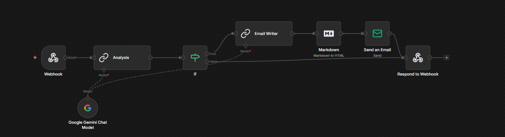
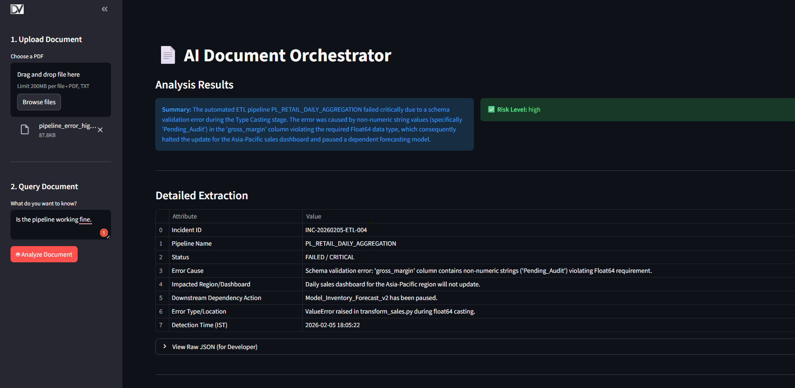
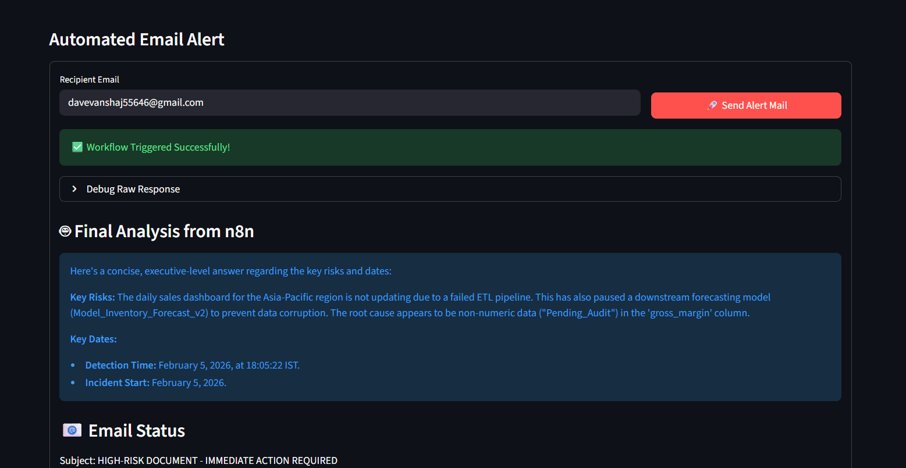

# 📄 AI-Powered Document Orchestrator


An intelligent document analysis system that combines **Generative AI** for structured data extraction with **n8n** for business process automation.

---

## 🚀 Live Demo

**[Live App](https://ai-analyze-alert.streamlit.app/)**

> **⚠️ Note on Architecture:**
> This application uses a **Hybrid Cloud Architecture**.
> * **Frontend:** Hosted on Streamlit Cloud.
> * **Automation Engine:** Hosted on a secure local server (n8n) connected via an encrypted SSH tunnel.
>
> *If the automation features (Email Alert) are offline, tunnel has expired.*

---


## 🧠 Project Overview

The **Document Orchestrator** solves the problem of unstructured data in business workflows. Instead of manually reading PDFs and typing emails, this tool:
1.  **Ingests** PDF documents via a web interface.
2.  **Analyzes** text using Google's **Gemini 3 Flash** (configurable) to extract structured JSON data.
3.  **Evaluates** risk levels automatically.
4.  **Triggers** a conditional n8n workflow to draft and send alert emails to stakeholders if specific criteria are met.








---

## ✨ Key Features

* **📄 PDF Ingestion:** Robust text extraction using `pdfplumber`.
* **🤖 Dynamic Extraction:** Uses Gemini API with structured JSON Schema to guarantee consistent outputs.
* **⚡ n8n Integration:** Seamless webhook connection to a low-code automation workflow.
* **📧 Automated Alerts:** Conditional logic (IF Nodes) determines whether to send an email via SMTP/Gmail.
* **🔄 Flexible Model Switching:** Easily switch between Gemini models (Flash/Pro) using a centralized config.
* **🛡️ Enterprise Security:** All API keys are managed via Streamlit Secrets; no hardcoded credentials.

---

## 🛠️ Architecture & Tech Stack

| Component | Technology | Responsibility |
| :--- | :--- | :--- |
| **Frontend** | Streamlit | User Interface, File Upload, Data Display |
| **AI Brain** | Google Gemini | Reasoning, Summarization, JSON Extraction |
| **Backend Logic** | Python (Requests/Pydantic) | API Orchestration, Data Validation |
| **Automation** | n8n (Self-Hosted) | Workflow Logic, Email Delivery, Webhook Handling |
| **Package Manager** | uv | Fast, reliable dependency management |

---

## ⚙️ Installation & Setup

### 1. Clone the Repository
```bash
git clone [https://github.com/dakshvanshaj/gemini-document-orchestrator](https://github.com/dakshvanshaj/gemini-document-orchestrator)
cd doc-orchestrator

```

### 2. Python Environment (using uv)

This project uses `uv` for lightning-fast dependency management.

```bash
# Sync dependencies
uv sync

# Or install manually via pip
pip install -r requirements.txt

```

### 3. Environment Configuration

Create a `.env` file for local testing (Do not commit this file):

```ini
GEMINI_API_KEY="your_google_api_key"
N8N_WEBHOOK_URL="http://localhost:5678/webhook/analyze"

```

---

## 🤖 Model Configuration

The application is designed to be model-agnostic. You can switch between different Gemini versions (e.g., from `1.5-flash` to `2.0-flash`) by editing a single file.

1. **Check Available Models:**
Run the included utility script to see which models your API key can access:
```bash
python aval_models.py

```


*Output Example: `✅ Found: models/gemini-3-flash-preview*`
2. **Update Configuration:**
Open `config.py` and update the `MODEL` variable:
```python
# config.py
MODEL = 'gemini-3-flash-preview' 

```


---

## ⚡ n8n Workflow Setup

The automation logic is defined in `workflows/n8n_workflow.json` 

1. **Install n8n:** (If not running) `npx n8n start --tunnel` or run via Docker.
2. **Import Workflow:**
* Open your n8n dashboard (`localhost:5678`).
* Go to **Workflows** -> **Import from File**.
* Select `n8n_workflow.json` from this repository.


3. **Configure Credentials:**
* Double-click the **Gmail/Email Node**.
* Add your SMTP credentials.


4. **Activate:** Toggle the workflow(Publish) to **Active** (Green).

---

## ☁️ Deployment Guide (Streamlit Cloud)

1. **Push code to GitHub.**
2. **New App on Streamlit Cloud:** Connect your repository.
3. **Configure Secrets:**
Go to *Advanced Settings* -> *Secrets* and add:
```toml
GEMINI_API_KEY = "your_google_key"
N8N_WEBHOOK_URL = "[https://your-tunnel-url.localhost.run/webhook/analyze](https://your-tunnel-url.localhost.run/webhook/analyze)"

```


4. **Deploy!**

---

## 🧪 Usage Instructions

1. **Upload:** Drag and drop a PDF file (e.g., an invoice or contract).
2. **Query:** Ask a specific question (e.g., *"What are the payment terms?"*).
3. **Analyze:** Click **Analyze Document** to see the AI extraction.
4. **Automate:** Enter a recipient email and click **Send Alert Mail**.
* *Success:* You will see a "Workflow Triggered" message and the generated email body.
* *Logic:* Emails are only sent if the AI determines the document is "High Risk" (or as per workflow logic).


---

## 🛡️ License

This project is open-source and available under the **MIT License**.
